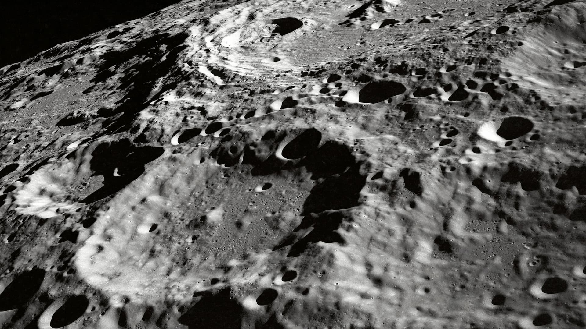

# Testing due to some issues with finding data after deployed on github

# Load Image

Works just fine
Lets Load an Image from web:
,

next attempt (working):

<!--  -->

# Lotti Files

<!-- ----------------------- load all required sources ---------------------- -->

1
  <dotlottie-player
    id="bismillah"
    class="mosque_Anim"
    autoplay
    speed="2"
    loop
    mode="bounce"
    src="bismillah.lottie""
    style="width: 100%">
</dotlottie-player>

2

This seems to work
  <dotlottie-player
    id="bismillah"
    class="mosque_Anim"
    autoplay
    speed="2"
    loop
    mode="bounce"
    src="/web_Path/bismillah.lottie"
    style="width: 100%">
</dotlottie-player>

3
  <dotlottie-player
    id="bismillah"
    class="mosque_Anim"
    autoplay
    speed="2"
    loop
    mode="bounce"
    src="../web_Path/bismillah.lottie"
    style="width: 100%">
</dotlottie-player>

---

ASSETS

1
  <dotlottie-player
    id="bismillah"
    class="../../web_Path/src/assets/0_Lotti/bismillah.lottie"
    autoplay
    speed="2"
    loop
    mode="bounce"
    src="bismillah.lottie""
    style="width: 100%">
</dotlottie-player>

2

  <dotlottie-player
    id="bismillah"
    class="mosque_Anim"
    autoplay
    speed="2"
    loop
    mode="bounce"
    src="../web_Path/src/assets/0_Lotti/bismillah.lottie"
    style="width: 100%">
</dotlottie-player>

3
  <dotlottie-player
    id="bismillah"
    class="mosque_Anim"
    autoplay
    speed="2"
    loop
    mode="bounce"
    src="/web_Path/src/assets/0_Lotti/bismillah.lottie"
    style="width: 100%">
</dotlottie-player>